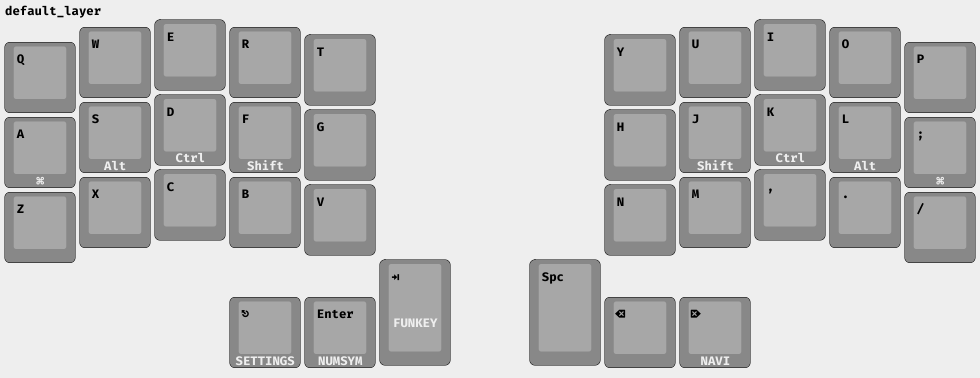
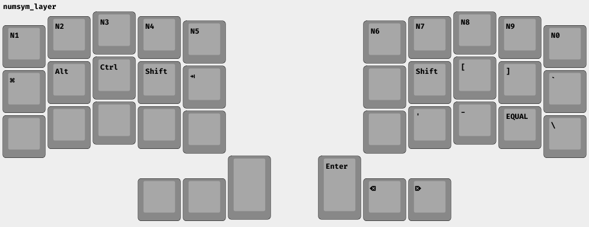
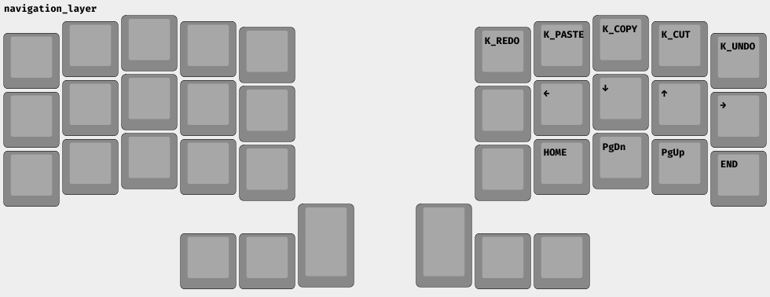
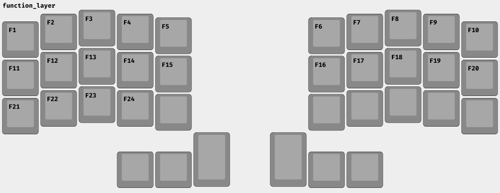

# A simple starter layout

Default layer is QWERTY with mod-tap on the homerow:

For the thumb clusters, layer-taps exist to switch layers while holding a key.
Space and Backspace intentionally do *not* have extra functionality so that you
can press and hold them to have these keys repeat.

The most important shift is into the number/symbol layer. To get any symbols
that is over a number, you *must* hold shift and then press the number (the same
as usual). I have no idea why this isn't standard in keyboard communities. You
can also press and hold a shift (via mod-tap) from the default layer.

If you want a key-repeat for enter, backspace, or delete, you can use the right
thumb cluster.

Navigation with arrow keys is in vim-style, but shifted to be directly under the
resting position of your fingers. Below the arrow keys is the bigger movements
(home/page down/page up/end).

Because it's not possible to hold things like "C-r" in a Colemak layout I also
include the official keycodes for copy, cut, paste, undo, redo. Technically
these should perform these operations on press, but I don't really use these so
I'm not sure how well supported these scan codes are. Ostensibly, it's possible
to bind these keycodes to something else.

The left side of the settings layer is for controlling bluetooth profiles:
the top row lets you choose profiles 1-5 (the rendering is incorrect). You can
also reset a profiles with `BT_CLR`.

The right side controls media and computer settings, while trying to mirror the nav layer a little:
- clear (actually not sure what this is)
- prev / next (for songs)
- rewind / ff is like (=- 30s) in a song
- vol up/down
- brightness min/down/up/max
- media stop/play-pause/mute
- PSCRN (printscreen) is on the P key in qwerty

A boring layer with way too many function keys.
