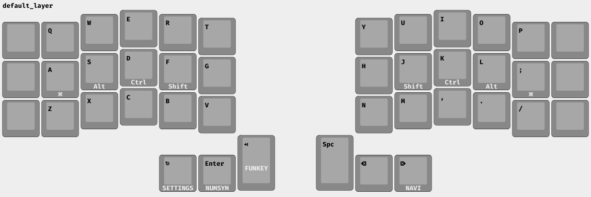
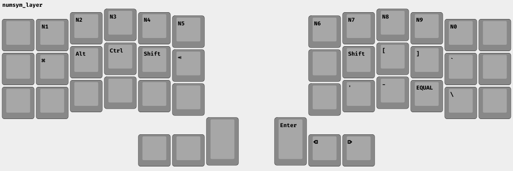
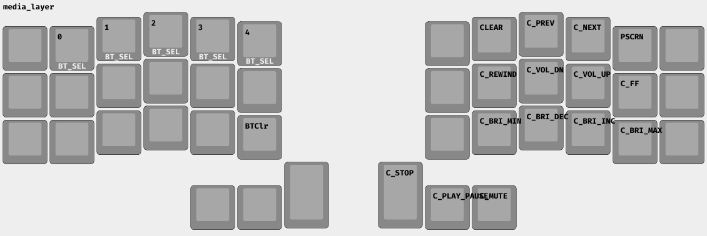
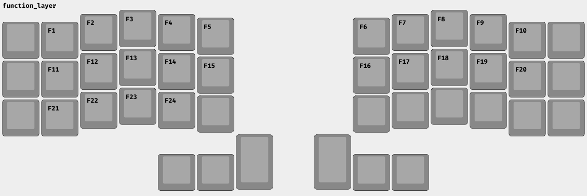

# A simple starter layout
## Getting Started
Turn both sides of the keyboard on and plug the left-side into a computer by
USB. You should immediately be able to type! Note that the left-side is the main
keyboard which communicates with the computer -- the right board connects to the
left via bluetooth.

The default layer looks like the following:

Text along the bottom edge of a key describes the "hold" behavior. If you hold
the key for longer than 200ms, this secondary functionality will be invoked. For
keys in the thumb cluster[1], holding a button will switch all keys to the
associated layer for the duration for the hold. 

[1] To disambiguate the unicode, the thumb-keys are: `ESC`, `Return`, `Tab`,
`Space`, `Backspace`, and `Delete`.

Some examples, referencing only the default layer:
- to press `3`: hold `Return` (to switch to the "numsym" layer) and press `E` (mapped to 3 in numsym)
- to press `#`: hold `F` (to turn on the "Shift" modifier), hold `Return` to get to the numsym layer, and finally press `E` again.

## editing the layout via GUI

Now it's time to check out zmk.studio.

Go to https://zmk.studio -- this is a very new GUI for editing your keymap
without compiling firmware. This website (accesible with most modern browsers,
and via desktop app) will ask for permissions to connect to your board and
something like "Corne" will appear in the list of accessible devices (alongside
a lot of `/dev/tty`s). Select your board and you will get a big floating message
requesting that you unlock your device. Press and hold `esc` to get to the
settings layer, then tap the bottom-left-most button (the button to the left of
`Z`). Refresh the page.

I have only done this once and there is, unfortunately, no feedback for this
part. If this doesn't work on your first try, some troubleshooting tips would be:
- Try unlocking the device before opening zmk.studio (or before giving
  zmk.studio access to the board).
- Turn your board (just the left side) on and off again to reset the "locked"
  state.
- Press your browser's permissions menu (usually next to the https lock), and
  revoke permissions for your board. Then refresh.

I did a combination of these when I tested this functionality -- It shouldn't
take too long, but some fiddling may be involved.

At this point, you should be able to edit the board layout on-the-fly.

The settings layer is probably the most opaque as it involves funcionality which
is only visible after selecting a key. You can refer to this repo, when in doubt.

## Connecting via bluetooth
Select the bluetooth profile by holding down `Esc` (to get to the settings
layer) then selecting any of Q,W,E,R,T to select bluetooth profiles 1-5. As you
select these profiles the display on the right side of the board will change
numbers to correspond with the selected bluetooth profile.

An unpaired profile will immediately go into pairing mode[2]. At this point you
can pair with your computer, phone, or tablet. If you ever need to reset the
profile, you can use `&kp BT_CLR` (bluetooth-clear) to erase the currently
active profile from the board. You will find this button in the settings layer
where `V` is. I believe I tested the board with profile 5, so now might be a
good time to erase this profile as a small exercise -- you will notice that
there isn't really any feedback. Using this button is almost always unnecessary,
though.

You can now pair with your computer and phone now, and switch profiles to fiddle
around.

[2] I think it stays in this state for ~5m before turning off, so if you get
distracted while pairing you may have to rotate the profile. 

## You are ready to go!
At this point you can either unplug your keyboard (if you haven't already) and
get started with the default firmware (described below), or you can keep your
board plugged in and customize the keymap. My first recommendation here would be
to add some keys to the outer columns that I didn't remap.

Feel free to drop me a line and ask questions!
# Appendix: the default firmware
## Each Layer, Explained.
If, at any point, you a canonical reference of the keymap, you can refer to the
`config/corne.keymap` file in this repository. 

These layers are currently mapped for a 3x5 layout -- no keys are mapped in any
of the outer columns of the boards. There is one exception, the new
`&studio_unlock` key, in the media/settings layer. This key unlocks the board
for use with zmk.studio.

The default layer is QWERTY with mod-tap on the homerow:

For the thumb clusters, layer-taps exist to switch layers while holding a key.
Space and Backspace intentionally do *not* have extra functionality so that you
can press and hold them to have these keys repeat.

The most important shift is into the number/symbol layer. To get any symbols
that is over a number, you *must* hold shift and then press the number (the same
as usual). I have no idea why this isn't standard in keyboard communities. You
can also press and hold a shift (via mod-tap) from the default layer.

If you want a key-repeat for enter, backspace, or delete, you can use the right
thumb cluster.

Navigation with arrow keys is in vim-style, but shifted to be directly under the
resting position of your fingers. Below the arrow keys is the bigger movements
(home/page down/page up/end).

Because it's not possible to hold things like "C-r" in a Colemak layout I also
include the official keycodes for copy, cut, paste, undo, redo. Technically
these should perform these operations on press, but I don't really use these so
I'm not sure how well supported these scan codes are. Ostensibly, it's possible
to bind these keycodes to something else.

The left side of the settings layer is for controlling bluetooth profiles:
the top row lets you choose profiles 1-5 (the rendering is incorrect). You can
also reset a profiles with `BT_CLR`.

There is also a new key close to the bottom-left of the left board, which
unlocks the keyboard for zmk.studio. This key does not render because this is a
new macro, introduced a few days ago.

The right side controls media and computer settings, while trying to mirror the nav layer a little:
- clear (actually not sure what this is)
- prev / next (for songs)
- rewind / ff is like (=- 30s) in a song
- vol up/down
- brightness min/down/up/max
- media stop/play-pause/mute
- PSCRN (printscreen) is on the P key in qwerty

A boring layer with way too many function keys.
